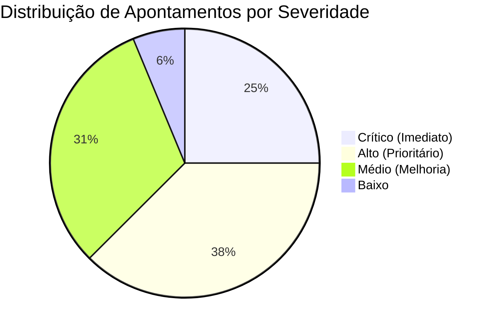
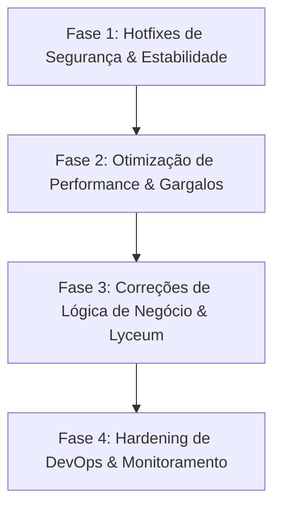

# 🛡️ Relatório de Auditoria Técnica e Varredura Completa: Nexus Core

**Data da Auditoria:** 27 de Agosto de 2026  
**Ambiente Auditado:** Produção / Servidor (`nexus-core`)  
**Módulos Analisados:** Backend (NestJS + Drizzle ORM + PostgreSQL), Frontend (Next.js 15 App Router + NextAuth), Integração Moodle (AVA Sync & Reports), Integração Lyceum (Academic Module MSSQL), Nginx e Docker Compose.

---

## 📊 1. Sumário Executivo e Matriz de Riscos

A varredura completa do repositório identificou **16 apontamentos críticos, altos e médios** divididos em 4 eixos principais:



| Categoria | Crítico | Alto | Médio | Total |
| :--- | :---: | :---: | :---: | :---: |
| 🔒 **Segurança & Autenticação** | 2 | 2 | 2 | **6** |
| ⚡ **Performance & Gargalos** | 1 | 2 | 1 | **4** |
| 🐛 **Erros de Lógica & Inconsistências** | 1 | 2 | 2 | **5** |
| 🚀 **DevOps, Docker & Infraestrutura** | 0 | 1 | 0 | **1** |

---

## 🔍 2. Detalhamento dos Apontamentos Encontrados

---

### 🔒 Eixo 1: Segurança e Vulnerabilidades

#### 🚨 [CRÍTICO 01] Falha Crítica de Bypass de Autenticação no `JwtAuthGuard`
* **Localização:** [`apps/backend/src/auth/jwt-auth.guard.ts`](apps/backend/src/auth/jwt-auth.guard.ts#L20-L24)
* **Descrição do Problema:**
  O guard global verifica se a URL contém `/api/auth/login` ou `/api/ava-sync` usando `request.url.includes()`:
  ```typescript
  if (request.url.includes('/api/ava-sync') || request.url.includes('/api/auth/login')) {
    return true;
  }
  ```
* **Impacto de Segurança:** Qualquer atacante externo sem token JWT pode burlar a autenticação de qualquer rota protegida da API simplesmente passando o parâmetro de query:
  `GET /api/users?bypass=/api/auth/login` ou `GET /api/scheduling/locals?x=/api/auth/login`.
* **Correção:** Usar correspondência exata de rota (`request.path === '/api/auth/login'`) ou decoradores `@Public()` do NestJS com `Reflector`.

---

#### 🚨 [CRÍTICO 02] Credenciais Reais e Tokens de API Moodle Expostos no Código e Git
* **Localização:** 
  * [`apps/backend/src/db/seed.ts`](apps/backend/src/db/seed.ts#L251-L308)
  * [`apps/backend/inspect_mat.js`](apps/backend/inspect_mat.js#L7-L10)
  * [`.env.example`](.env.example#L16-L21)
* **Descrição do Problema:**
  * Tokens de produção e sandbox das instâncias do Moodle (`UniEVANGÉLICA`, `EaD`, `FAEGO`, `RAÍZES`, `EEFN`) estão hardcoded no arquivo de seed.
  * Usuário (`PortAeeConsult`), senha (`Port4eeC0nsult@Tudo.`) e IP interno (`172.29.44.90`) do banco SQL Server (Lyceum) estão commitados no repositório.
* **Correção:** Mover todas as credenciais sensíveis exclusivamente para variáveis de ambiente `.env` no servidor e rotacionar os tokens/senhas expostos.

---

#### ⚠️ [ALTO 01] Ausência de Validação de Permissões RBAC nas Rotas de Agendamento
* **Localização:** [`apps/backend/src/scheduling/scheduling.controller.ts`](apps/backend/src/scheduling/scheduling.controller.ts#L10-L165)
* **Descrição do Problema:**
  Rotas administrativas como criação/edição/exclusão de polos (`createLocal`, `updateLocal`), slots de horários (`createOption`, `updateOption`), cancelamento de agendamento e importação em massa (`importBookings`) não validam permissão de módulo nem perfil de administrador. Qualquer usuário autenticado pode alterar polos ou importar agendamentos.
* **Correção:** Implementar verificação de permissão do módulo `backoffice` / `SuperAdmin` no `SchedulingService` ou criar um Guard RBAC de Módulos.

---

#### ⚠️ [ALTO 02] E-mail de Super Administrador Hardcoded na Lógica de Autenticação
* **Localização:** [`apps/backend/src/auth/auth.service.ts`](apps/backend/src/auth/auth.service.ts#L41)
* **Descrição:** `const isSuperAdmin = adminGroups.some(...) || user.email === 'rrrdias25@gmail.com';`
* **Correção:** A concessão de privilégios de super admin deve ser baseada unicamente no vínculo com a tabela `groups` no banco de dados.

---

#### ⚠️ [MÉDIO 01] Concatenação Dinâmica em Queries SQL Server (Lyceum Sync)
* **Localização:** [`apps/backend/src/academic/academic-sync.service.ts`](apps/backend/src/academic/academic-sync.service.ts#L64-L180)
* **Descrição:** Parâmetros `periodsInStr` e `inParams` são interpolados como strings puras na query MSSQL (`WHERE U.ID IN (${inParams})`).
* **Correção:** Utilizar queries parametrizadas com `sql.Request` ou batches seguros.

---

#### ⚠️ [MÉDIO 02] CORS Habilitado Sem Restrição de Origem
* **Localização:** [`apps/backend/src/main.ts`](apps/backend/src/main.ts#L8)
* **Descrição:** `app.enableCors()` sem parâmetros em produção permite requisições de qualquer origem externa.
* **Correção:** Configurar `origin` com os domínios oficiais e `credentials: true`.

---

### ⚡ Eixo 2: Performance, Gargalos e Escalabilidade

#### 🚨 [CRÍTICO 03] Gargalo de Memória e CPU por Busca Sem Paginação SQL no AVA Reports
* **Localização:** [`apps/backend/src/ava-reports/ava-reports.service.ts`](apps/backend/src/ava-reports/ava-reports.service.ts#L170-L198)
* **Descrição do Problema:**
  Nos métodos `getProgressData`, `getGradesData` e `getAvaDashboardStats`, o backend executa `SELECT` de **todos os registros da tabela** para a memória RAM do Node.js (podendo atingir centenas de milhares de linhas). O cálculo de médias, medianas, paginação e filtros é feito em memória JavaScript, seguido de um segundo `SELECT` com `inArray(ids)`.
* **Impacto:** Em produção com grandes volumes de alunos, isso causa congelamento do Event Loop do Node.js, tempo de resposta superior a 10 segundos e crashes por **Out of Memory (OOM)**.
* **Correção:** Mudar os cálculos estatísticos para queries agregadas SQL nativas no PostgreSQL (`COUNT`, `AVG`, `SUM`, `PERCENTILE_CONT`) e aplicar `LIMIT`/`OFFSET` direto na query principal.

---

#### ⚠️ [ALTO 03] Operação de Importação em Massa com N+1 Queries Sequenciais
* **Localização:** [`apps/backend/src/scheduling/scheduling.service.ts`](apps/backend/src/scheduling/scheduling.service.ts#L470-L558)
* **Descrição:** No método `importBookings`, para cada linha do CSV (ex: 2.000 linhas), são disparadas 4 queries síncronas sequenciais (totalizando ~8.000 queries sem transação global).
* **Impacto:** Importações demoram minutos e geram timeout 504 no Nginx.
* **Correção:** Realizar pré-carregamento em memória dos polos/opções existentes e fazer inserção em lote (`INSERT INTO ... VALUES (...) ON CONFLICT DO UPDATE`) dentro de uma transação Drizzle.

---

#### ⚠️ [ALTO 04] Inconsistência de Portas no Proxy Nginx
* **Localização:** 
  * [`nginx/nexus.conf`](nginx/nexus.conf#L19) (`proxy_pass http://localhost:3001/;`)
  * [`docker-compose.prod.yml`](docker-compose.prod.yml#L33) (`BACKEND_PORT: 3004`)
* **Descrição:** No arquivo de configuração do Nginx para `/nexus-api/`, a porta de destino está configurada como `3001`, enquanto no compose de produção o backend é exposto na porta `3004`.
* **Correção:** Alinhar `nexus.conf` para apontar para `http://localhost:3004/`.

---

#### ⚠️ [MÉDIO 03] Métricas Fake de Latência no Dashboard do Sistema
* **Localização:** [`apps/backend/src/system/system.service.ts`](apps/backend/src/system/system.service.ts#L123)
* **Descrição:** `latency: lastSync ? Math.floor(Math.random() * 20) + 15 : 0` gera latência randômica artificial.
* **Correção:** Medir a latência real durante a chamada HTTP de sync e persistir o tempo de execução no log.

---

### 🐛 Eixo 3: Erros de Lógica e Inconsistências

#### 🚨 [CRÍTICO 04] Possibilidade de Loop Infinito (Remote DoS) na Criação de Opções de Agendamento
* **Localização:** [`apps/backend/src/scheduling/scheduling.service.ts`](apps/backend/src/scheduling/scheduling.service.ts#L98-L104)
* **Descrição do Problema:**
  ```typescript
  while (true) {
    const current = getNextTimeStr(data.horaInicio, currentIndex);
    if (current >= endT) break;
    times.push(current);
    currentIndex++;
  }
  ```
  Se `horaInicio` for uma string com formato inesperado (ex: sem dois dígitos ou inválida), `getNextTimeStr` gera `"NaN:NaN:00"`. A comparação `"NaN:NaN:00" >= endT` sempre retorna `false`, travando o processo Node.js em um loop infinito com 100% de CPU.
* **Correção:** Validar estritamente o formato HH:MM com Regex e adicionar um limite máximo de iterações (`currentIndex > 48`).

---

#### ⚠️ [ALTO 05] Sincronização de Discentes do Lyceum Inserindo `matricula: null` e `usuario: null`
* **Localização:** [`apps/backend/src/academic/academic-sync.service.ts`](apps/backend/src/academic/academic-sync.service.ts#L204-L205)
* **Descrição:** Ao sincronizar discentes com a tabela `academicDiscente`, os campos `matricula` e `usuario` são inseridos explicitamente como `null`. Quando o usuário pesquisa discentes por matrícula ou usuário na tela do Módulo Acadêmico, nenhum resultado é retornado.
* **Correção:** Mapear `matricula: u.MATRICULA || u.ID` e `usuario: u.USUARIO || u.EMAIL` a partir da view do Lyceum.

---

#### ⚠️ [ALTO 06] Colisão de Deduplicação no AVA Sync quando `alunoId` é Vazio
* **Localização:** [`apps/backend/src/ava-sync/ava-sync.service.ts`](apps/backend/src/ava-sync/ava-sync.service.ts#L246-L254)
* **Descrição:** Se o retorno do Moodle não possuir `aluno_id`, o registro assume string vazia `""`, fazendo com que múltiplos alunos diferentes na mesma instituição/curso colidam na chave de mapa `${instituicao}--${curso}`, sobrescrevendo dados de outros alunos.
* **Correção:** Usar `matricula` ou `usuario` como chave de fallback caso `alunoId` seja nulo/vazio.

---

#### ⚠️ [MÉDIO 04] Tratamento de Erro no `fetchFromApi` do Frontend Interceptando Redirecionamento
* **Localização:** [`apps/frontend/src/app/actions/api.ts`](apps/frontend/src/app/actions/api.ts#L26-L39)
* **Descrição:** Quando a API retorna 401, o método chama `signOut({ redirectTo: "/nexus/login" })`. No Next.js / NextAuth v5, o `signOut` lança uma exceção interna de controle (`NEXT_REDIRECT`). O bloco `catch (error: any)` captura essa exceção e relança como erro genérico, quebrando o redirecionamento para o login.
* **Correção:** Verificar se é um erro de redirecionamento do Next.js antes de capturar no catch.

---

#### ⚠️ [MÉDIO 05] `ignoreDuringBuilds` e `ignoreBuildErrors` Ativados no Next.js
* **Localização:** [`apps/frontend/next.config.ts`](apps/frontend/next.config.ts#L46-L51)
* **Descrição:** O build de produção ignora erros de lint e de TypeScript. Erros de tipagem e de chamadas de API quebradas passam despercebidos durante o deploy.
* **Correção:** Desativar essas flags e corrigir os eventuais avisos de tipagem.

---

## 📋 3. Plano de Ação e Correção Priorizado



---

### 🔴 Fase 1: Hotfixes Imediatos (Segurança & Estabilidade)

| Item | Tarefa | Arquivos Afetados | Ação Necessária |
| :--- | :--- | :--- | :--- |
| **1.1** | **Corrigir Bypass do `JwtAuthGuard`** | `apps/backend/src/auth/jwt-auth.guard.ts` | Substituir `includes` por validação estrita de rotas públicas via `Set` ou decorador `@Public()`. |
| **1.2** | **Prevenir Loop Infinito DoS no Scheduling** | `apps/backend/src/scheduling/scheduling.service.ts` | Validar formato `HH:MM` com regex e impor teto de iterações (`max 48`). |
| **1.3** | **Remover Hardcode de Super Admin** | `apps/backend/src/auth/auth.service.ts` | Remover verificação de e-mail estático; basear apenas no grupo do banco. |
| **1.4** | **Corrigir Redirecionamento no NextAuth** | `apps/frontend/src/app/actions/api.ts` | Tratar exceção `NEXT_REDIRECT` para não interceptar o logout. |

---

### 🟠 Fase 2: Otimização de Performance & Gargalos

| Item | Tarefa | Arquivos Afetados | Ação Necessária |
| :--- | :--- | :--- | :--- |
| **2.1** | **Paginação & Agregação SQL no AVA Reports** | `apps/backend/src/ava-reports/ava-reports.service.ts` | Substituir carregamento total em RAM por queries nativas com `LIMIT/OFFSET` e agregação SQL. |
| **2.2** | **Otimização de Lote no `importBookings`** | `apps/backend/src/scheduling/scheduling.service.ts` | Pré-carregar listas de polos/slots e usar `INSERT ... ON CONFLICT` em lote. |
| **2.3** | **Alinhar Portas no Nginx de Produção** | `nginx/nexus.conf` | Atualizar porta do proxy para `http://localhost:3004/`. |

---

### 🟡 Fase 3: Correções de Lógica & Integrações

| Item | Tarefa | Arquivos Afetados | Ação Necessária |
| :--- | :--- | :--- | :--- |
| **3.1** | **Corrigir Sync de Matrícula/Usuário Discente** | `apps/backend/src/academic/academic-sync.service.ts` | Mapear os campos `MATRICULA` e `USUARIO` na query e inserção. |
| **3.2** | **Sanitizar Chave de Deduplicação no Moodle Sync** | `apps/backend/src/ava-sync/ava-sync.service.ts` | Utilizar fallback `item.matricula` caso `item.aluno_id` seja vazio. |
| **3.3** | **Implementar RBAC no Módulo Scheduling** | `apps/backend/src/scheduling/scheduling.service.ts` | Adicionar validação de acesso ao módulo `backoffice` antes de mutações. |

---

### 🔵 Fase 4: DevOps, Limpeza e Hardening

| Item | Tarefa | Arquivos Afetados | Ação Necessária |
| :--- | :--- | :--- | :--- |
| **4.1** | **Sanitizar Tokens e Credenciais no Repositório** | `apps/backend/src/db/seed.ts`, `.env.example`, `inspect_mat.js` | Substituir tokens e senhas reais por referências a `process.env`. |
| **4.2** | **Habilitar Validação Rígida no Build Next.js** | `apps/frontend/next.config.ts` | Desativar `ignoreDuringBuilds` e `ignoreBuildErrors`. |
| **4.3** | **Restringir CORS no Backend** | `apps/backend/src/main.ts` | Definir origens permitidas conforme ambiente. |

---

## 🎯 4. Recomendações de Execução

Recomenda-se iniciar imediatamente pela **Fase 1 (Hotfixes de Segurança e Estabilidade)** para fechar a brecha de autenticação e prevenir possíveis instabilidades no servidor, seguindo sequencialmente para as Fases 2, 3 e 4.
